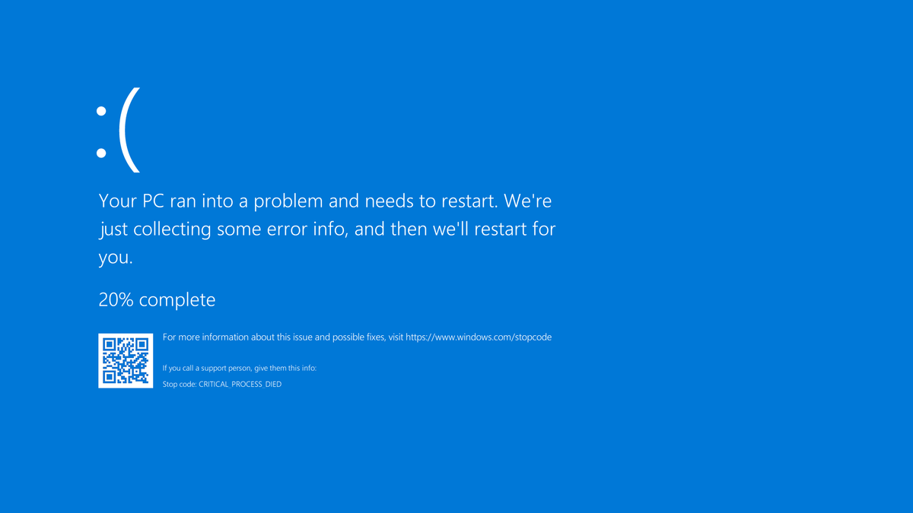

# winboom
💣 Because sometimes, you just need to watch the world BSOD.

<br>

> [!WARNING]
> It's not a joke, it truly causes a system crash. BSODs can cause data loss or some files to corrupt, so save everything just in case.

## About
**winboom** is a tiny, totally unnecessary but undeniably fun program written in C++ designed to porposefully cause a BSOD by raising an exception in ntdll.dll in Windows.

It gives you a dialog box asking if you want to crash your Windows system, if you click "yes", say goodbye to your Windows. Instant BSOD guaranteed!

It works in any NT-based system (sorry MS-DOS folks), both physical and virtualised.

## How to use
> [!IMPORTANT]
> Since winboom handles low level stuff, you need to run this program as administrator in order for it to work!

The easy way to use winboom follows like this:
- Go to the **Releases** section of this repo.
- Download the latest **winboom.exe** provided.
- Open the file as administrator.
- Click "Yes" in the winboom box.

Now, here comes the hard way, if for some reason you want to rebuild this, you can do it like this:

```sh
git clone https://github.com/PwLDev/winboom.git
cd winboom
mkdir build
cd build
cmake ..
cmake --build . --config Release
```
And that's it, you have your freshly built **winboom.exe** 

## FAQ
<details>
<summary>My antivirus flagged this as dangerous, what can I do?</summary>

It's totally normal because antiviruses are designed to avoid these stuff to happen, but you can temporarily disable it if you really want to run winboom.exe.
</details>

<details>
<summary>Will my PC boot normally after this?</summary>

Yes, it should boot up as usual. Yet there is a little chance that some file may get corrupt, in that case the Windows automatic repair can handle that, but it's pretty unlikely to happen.
</details>

<details>
<summary>Is there something for Unix?</summary>

Try running this command: `:(){ :|:& };:`
</details>

<details>
<summary>Why did you make this?</summary>

I was heavily bored at my home and with nothing to do, so I remembered that once, a long time ago, I wrote a russian roulette code in Python to BSOD Windows, so I reused that code and translated it to C++.
</details>

<details>
<summary>Can I prank someone with this?</summary>

Sure, but I'm not responsible for any damage caused to physical devices. Proceed with caution!
</details>

## Credits
Made by [PwLDev](https://github.com/PwLDev).
Licensed under the [MIT LIcense](LICENSE).